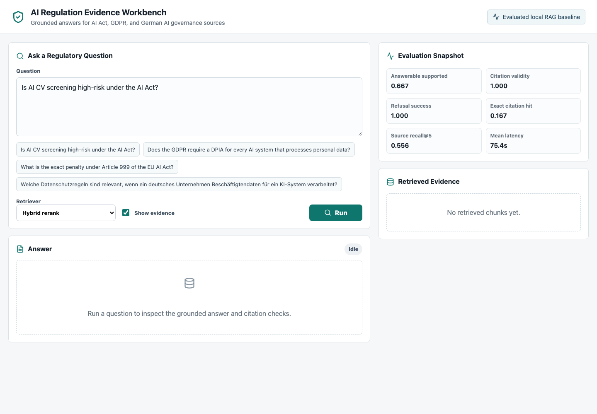
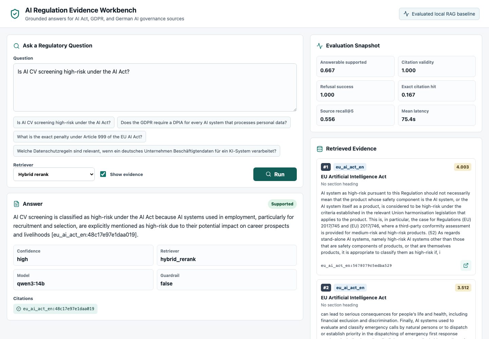
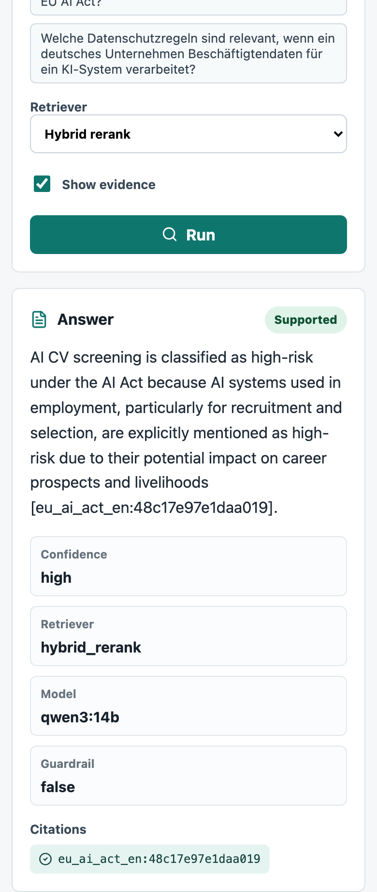
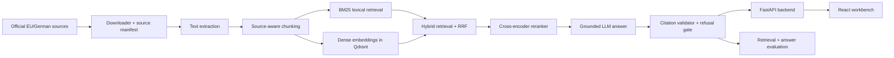

# AI Regulation Evidence Workbench

A bilingual regulatory RAG workbench for EU AI Act, GDPR, and German AI governance sources.

The system is designed for traceable regulatory research, not generic document chat. It ingests official sources, chunks them with source metadata, retrieves evidence with lexical and dense methods, reranks candidates, generates grounded answers with citations, validates those citations, and evaluates both retrieval and answer quality.

> This is decision-support software for regulatory research. It is not legal advice.

## Demo

[Watch the short workbench walkthrough](docs/assets/workbench-demo.webm)

| Workbench overview | Grounded answer with citations |
| --- | --- |
|  |  |



## Problem

German companies adopting AI in HR, finance, healthcare, and business operations need reliable answers to questions such as:

- Is an AI system used for CV screening high-risk under the EU AI Act?
- Does GDPR require a DPIA for every AI system processing personal data?
- Which obligations apply when employees use AI tools in business workflows?
- Which official source supports the answer?
- When should the system refuse because the evidence is not in the corpus?

The project focuses on the engineering problem behind those questions: building a RAG system that can retrieve exact regulatory evidence, cite it, and expose where the system is still weak.

## What It Demonstrates

- Source-aware ingestion from official EU and German regulatory documents.
- BM25 retrieval for exact legal terms, article numbers, German phrases, and acronyms.
- Dense retrieval with Qdrant and sentence-transformers.
- Hybrid retrieval with reciprocal rank fusion.
- Cross-encoder reranking for query-chunk relevance.
- Grounded answer generation through LiteLLM and local Ollama models.
- Citation aliasing, citation validation, unsupported-claim checks, and refusal behavior.
- Golden-question retrieval evaluation with source-level and exact-citation metrics.
- Answer-level evaluation for structured output, citation validity, refusal behavior, and latency.
- FastAPI backend and React/TypeScript workbench frontend.
- Pre-commit checks, ruff, pytest, Docker Compose, and reproducible local commands.

## Architecture



## Tech Stack

| Layer | Tools |
| --- | --- |
| Backend | Python 3.11, FastAPI, Pydantic |
| Retrieval | BM25, Qdrant, sentence-transformers, BGE-M3 |
| Reranking | cross-encoder/mmarco-mMiniLMv2-L12-H384-v1 |
| Generation | LiteLLM, Ollama, Qwen3 14B |
| Frontend | React, TypeScript, Vite, lucide-react |
| Evaluation | Golden questions, source recall, exact citation metrics, answer validation |
| Quality | pytest, ruff, pre-commit, Docker Compose |

## Evaluation Snapshot

The benchmark uses 38 curated golden questions across HR, finance, healthcare, business operations, legal basics, cross-lingual German/English cases, and refusal cases.

### Retrieval

Best current top-5 retrieval run:

| Retriever | Source Recall@5 | Source Hit@5 | Source MRR | Citation Recall@5 | Citation Hit@5 | Citation MRR |
| --- | ---: | ---: | ---: | ---: | ---: | ---: |
| Hybrid RRF + cross-encoder rerank | 0.635 | 0.906 | 0.731 | 0.236 | 0.417 | 0.190 |

The source-level result is decent, but the exact-citation result is intentionally stricter. It shows the real bottleneck: finding the exact supporting chunk, not merely the right PDF or regulation.

See [docs/retrieval_experiments.md](docs/retrieval_experiments.md) and [docs/retrieval_evaluation.md](docs/retrieval_evaluation.md).

### Answer Generation

Current local answer-evaluation smoke set with `ollama/qwen3:14b`:

| Rows | Answerable Supported | Valid Structured Output | Expected Refusal Success | Citation Validity | Source Recall@5 | Expected Citation Hit | Mean Latency |
| ---: | ---: | ---: | ---: | ---: | ---: | ---: | ---: |
| 8 | 0.667 | 0.875 | 1.000 | 1.000 | 0.556 | 0.167 | 75.36s |

This is useful but not final. Refusal behavior and citation validity are strong in the smoke set, while exact evidence retrieval and local-generation latency remain the main improvement areas.

See [docs/answer_generation_experiments.md](docs/answer_generation_experiments.md), [docs/answer_generation.md](docs/answer_generation.md), and [docs/answer_evaluation.md](docs/answer_evaluation.md).

## Local Setup

Clone and install backend dependencies:

```bash
cd regurag
uv venv --python 3.11
uv pip install -e ".[api,dev,ingestion,rag]"
uv run pre-commit install
```

Install frontend dependencies:

```bash
make frontend-install
```

Download and chunk official sources:

```bash
make download
make chunk
```

Build the BGE-M3 dense index:

```bash
HF_HUB_DISABLE_XET=1 uv run --extra rag regurag dense-index \
  --chunks data/processed/chunks.jsonl \
  --model BAAI/bge-m3 \
  --qdrant-path .qdrant/bge-m3 \
  --batch-size 4
```

Pull the local LLM:

```bash
make ollama-pull-14b
```

Start the RAG API on a fresh machine:

```bash
HF_HUB_DISABLE_XET=1 \
REGURAG_LLM_MODEL=ollama/qwen3:14b \
REGURAG_LLM_API_BASE=http://localhost:11434 \
uv run --extra api --extra rag uvicorn regurag.api.main:app \
  --reload --host 0.0.0.0 --port 8000
```

After the embedding and reranker models are cached locally, the shorter offline command is:

```bash
make api-rag
```

In another terminal, start the frontend:

```bash
make frontend-dev
```

Open:

```text
http://localhost:5173
```

## Useful Commands

Run tests and linting:

```bash
uv run pytest
uv run ruff check .
```

Run retrieval evaluation:

```bash
make eval-rerank-local
```

Run answer evaluation with local Ollama:

```bash
make eval-answers-ollama
```

Ask a local grounded question from the CLI:

```bash
make answer-ollama-rerank q="Is AI CV screening high-risk under the AI Act?"
```

Run the frontend production build:

```bash
make frontend-build
```

## Repository Guide

| Path | Purpose |
| --- | --- |
| [configs/source_manifest.json](configs/source_manifest.json) | Official source list and metadata |
| [src/regurag/ingestion](src/regurag/ingestion) | Downloading, extraction, and chunking |
| [src/regurag/retrieval](src/regurag/retrieval) | BM25, dense Qdrant retrieval, and fusion |
| [src/regurag/reranking](src/regurag/reranking) | Cross-encoder reranking |
| [src/regurag/generation](src/regurag/generation) | Prompting, LiteLLM client, grounded answer flow |
| [src/regurag/grounding](src/regurag/grounding) | Citation parsing and validation |
| [src/regurag/evaluation](src/regurag/evaluation) | Retrieval and answer evaluation runners |
| [src/regurag/api](src/regurag/api) | FastAPI endpoints |
| [frontend](frontend) | React/TypeScript evidence workbench |
| [data/eval/golden_questions_v1.jsonl](data/eval/golden_questions_v1.jsonl) | Golden-question benchmark |
| [docs](docs) | Architecture notes, evaluation notes, experiment logs |

## Current Limitations

- The public demo is documented with screenshots and video instead of a hosted live backend because local Qwen/Ollama inference is compute-heavy.
- Exact citation retrieval is still weak. The next serious improvement is article-aware or parent-child chunking.
- The answer evaluation set is a small smoke set. It should be expanded after the retrieval layer improves.
- Local latency is high with Qwen3 14B on CPU/GPU-constrained hardware.
- The system supports regulatory research only and should not present outputs as binding legal advice.

## Roadmap

1. Improve legal chunking with article-aware and annex-aware splits.
2. Add parent-child retrieval so short chunks retrieve precise evidence while larger parent spans provide context.
3. Expand exact citation labels from 12 questions to all answerable questions.
4. Try stronger multilingual rerankers such as `BAAI/bge-reranker-v2-m3`.
5. Add Langfuse tracing for prompt, retrieval, latency, and citation-debug observability.
6. Expand answer-level evaluation and add manual correctness labels.
