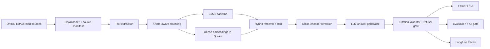

# ReguRAG

ReguRAG is a bilingual regulatory intelligence RAG system for EU AI Act, GDPR, and German AI governance sources.

The system is designed around traceable answers from official documents, not generic document chat. It combines reproducible ingestion, source-aware chunking, lexical and dense retrieval, hybrid fusion, reranking, grounded answer generation, citation enforcement, refusal behavior, evaluation, observability, and CI quality gates.

## Problem Statement

German companies adopting AI in HR, finance, healthcare, and business operations need reliable answers to questions like:

- Does this AI use case look high-risk under the EU AI Act?
- What GDPR issues appear if we use customer support data for model training?
- What documentation or AI literacy expectations apply to employees using AI tools?
- Which official source supports the answer?
- When should the system refuse because the evidence is not in the corpus?

ReguRAG retrieves and answers from official EU and German sources, with every answer tied back to retrieved evidence. It is decision support for regulatory research, not legal advice.

## Current System

The current system contains:

- Source manifest for official EU/German regulatory sources.
- Reproducible downloader for raw source files.
- Text extraction and article-aware chunking utilities.
- Transparent BM25 retrieval baseline.
- Dense retrieval commands backed by Qdrant and sentence-transformers.
- Reciprocal rank fusion for hybrid retrieval.
- Cross-encoder reranking.
- Structured LLM answer generation through LiteLLM.
- Citation extraction and validation.
- Refusal gate for unsupported answers.
- Retrieval evaluation over an approved 38-question golden set.
- Source-level and citation-level retrieval metrics: Recall@K, Precision@K, Hit@K, MRR.
- FastAPI shell with retrieval-only `/query` endpoint.
- Docker Compose with API and Qdrant.
- GitHub Actions CI for tests and linting.

## Target Architecture



## Quick Start

Recommended local setup:

```bash
cd /Users/faizan/Desktop/regurag
uv venv --python 3.11
uv pip install -e ".[api,dev,ingestion]"
uv run pre-commit install
uv run pytest
```

The pre-commit hook blocks commits when project requirements fail:

- no staged `.env` files
- no staged generated `data/raw/*` or `data/processed/*` artifacts, except `.gitkeep`
- no obvious API keys or private keys in text files
- `ruff check .` must pass
- `pytest` must pass

Run the retrieval-only API:

```bash
uv run uvicorn regurag.api.main:app --reload --host 0.0.0.0 --port 8000
```

Open:

```text
http://localhost:8000/docs
```

Run local search before real ingestion:

```bash
uv run regurag search --chunks data/processed/chunks.jsonl --query "AI systems for employment screening"
```

Download and chunk official sources:

```bash
uv run regurag download --manifest configs/source_manifest.json --raw-dir data/raw
uv run regurag chunk --manifest configs/source_manifest.json --raw-dir data/raw --out data/processed/chunks.jsonl
```

Docker:

```bash
docker compose up --build
```

Dense retrieval:

```bash
docker compose up -d qdrant
uv run --extra rag regurag dense-index --chunks data/processed/chunks.jsonl
uv run --extra rag regurag dense-search --query "Can we train a model on customer support tickets?"
uv run --extra rag regurag compare-retrieval --chunks data/processed/chunks.jsonl --query "Can we train a model on customer support tickets?"
```

The default embedding model is `sentence-transformers/paraphrase-multilingual-MiniLM-L12-v2` because it is fast enough for local iteration. For stronger multilingual retrieval, switch to:

```bash
uv run --extra rag regurag dense-index \
  --chunks data/processed/chunks.jsonl \
  --model BAAI/bge-m3 \
  --batch-size 4
```

Retrieval evaluation:

```bash
uv run regurag eval-retrieval \
  --chunks data/processed/chunks.jsonl \
  --questions data/eval/golden_questions_v1.jsonl \
  --retrievers bm25
```

Full local BM25 + dense + hybrid evaluation without Docker:

```bash
uv run --extra rag regurag eval-retrieval \
  --chunks data/processed/chunks.jsonl \
  --questions data/eval/golden_questions_v1.jsonl \
  --retrievers bm25,dense,hybrid \
  --qdrant-path .qdrant/local \
  --output-md reports/retrieval_eval_latest.md \
  --output-json reports/retrieval_eval_latest.json
```

Hybrid reranking evaluation with the BGE-M3 index:

```bash
make eval-rerank-local
```

Inspect the answer-generation prompt without API calls:

```bash
make answer-dry-run q="Is AI CV screening high-risk under the AI Act?"
```

Run grounded answer generation through LiteLLM:

```bash
REGURAG_LLM_MODEL="<provider>/<model>" make answer-local \
  q="Is AI CV screening high-risk under the AI Act?"
```

Run grounded answer generation locally with Ollama:

```bash
make ollama-pull-8b
make answer-ollama-local q="Is AI CV screening high-risk under the AI Act?"
```

See [docs/retrieval_evaluation.md](docs/retrieval_evaluation.md) for metric definitions and the current baseline snapshot.
See [docs/retrieval_experiments.md](docs/retrieval_experiments.md) for the running experiment log.
See [docs/answer_generation.md](docs/answer_generation.md) for the structured answer and citation-validation workflow.

## Why BM25 First?

BM25 is a keyword retrieval algorithm. It is not "old-fashioned"; it is still useful in legal and regulatory RAG because exact terms matter:

- Article numbers
- Acronyms
- German legal phrases
- Regulator names
- Domain terms like "high-risk", "AI literacy", "legal basis"

Dense vector search is better at semantic similarity, but it can miss exact terms. The production version will combine BM25 and dense vectors, then rerank.

## Next Milestones

1. Add answer-level evaluation for faithfulness and refusal accuracy.
2. Expand exact citation labels from 12 to all answerable questions.
3. Improve legal chunking with article-aware splits.
4. Try a stronger reranker such as `BAAI/bge-reranker-v2-m3`.
5. Add Langfuse tracing.
6. Build a simple bilingual UI.
7. Add deployment documentation and operational runbooks.

## Technical Summary

ReguRAG is a production-shaped RAG system for AI Act/GDPR regulatory research in German business contexts. It uses source-aware ingestion, BM25 and dense retrieval, hybrid fusion, reranking, structured LLM answer generation, citation validation, refusal handling, retrieval metrics, CI, and Dockerized deployment.
